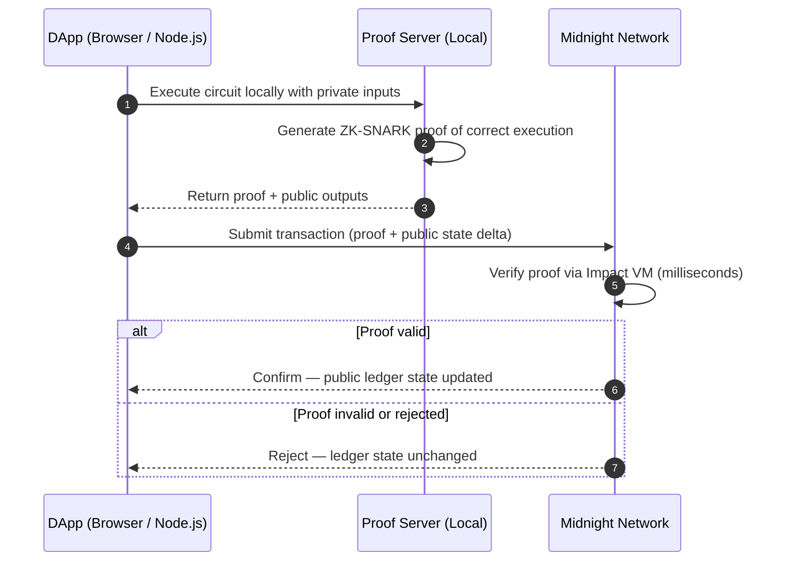
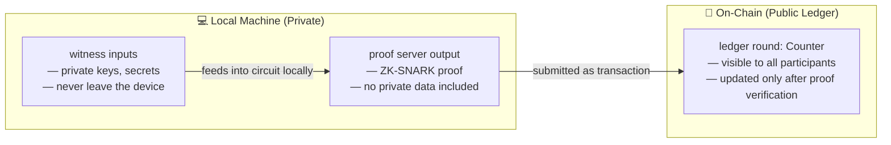
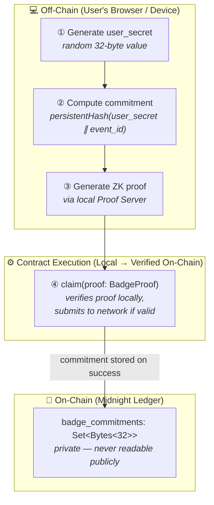
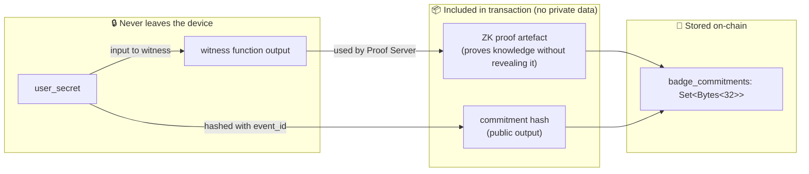
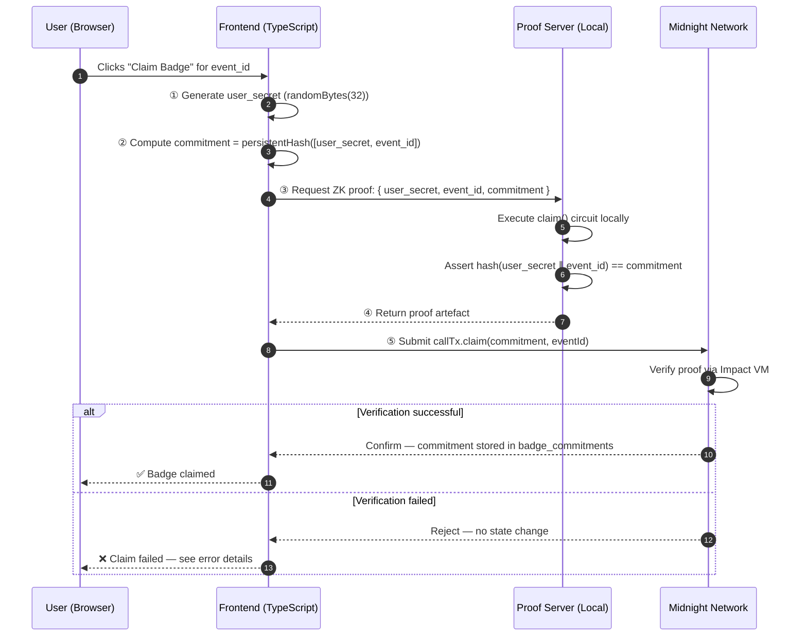
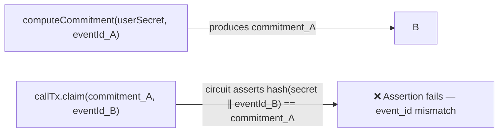
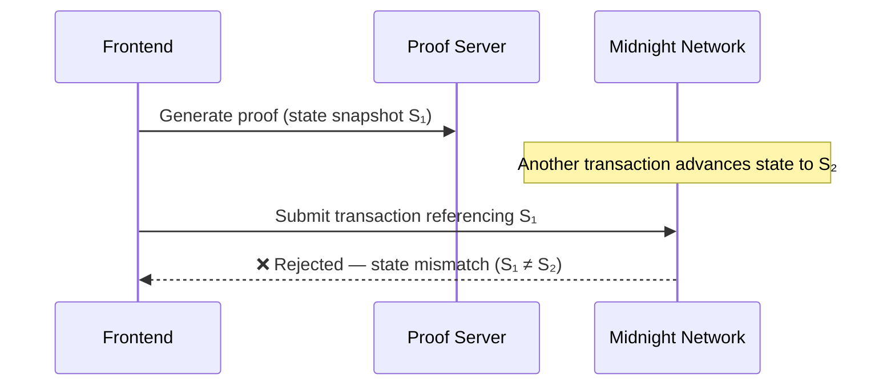
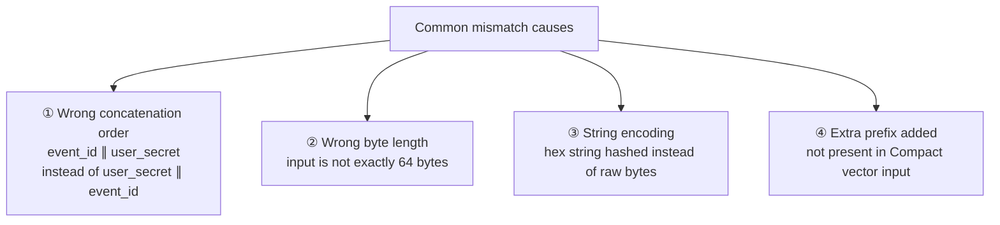
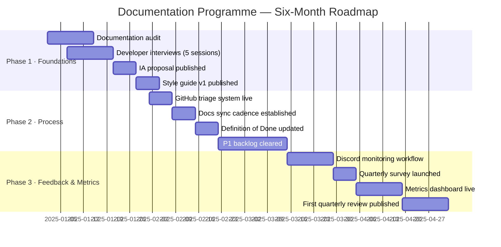

# MidnightNetwork_Documentation
# Midnight Network — Technical Writer Assessment
**Candidate:** Samuel Okediji
**Submission format:** Single Markdown file (all parts)

---

# Part 1 — Rewrite: Initializing and Incrementing a Private Counter

---

## Overview

> **What you'll learn**
>
> - How Compact separates public ledger state from private local state
> - How the Midnight execution pipeline works: local computation → ZK proof → on-chain verification
> - How to call a contract circuit from TypeScript using Midnight.js
> - How to diagnose and recover from proof generation failures

---

## Execution Model

Before writing any contract code, understanding Midnight's execution model is essential. Unlike traditional blockchains where validators re-execute contract logic, **Midnight executes circuits locally on the user's machine** and submits a cryptographic proof of correct execution to the network.



> **Key principle:** If proof generation fails at step 2, **nothing is submitted**. The ledger state does not change. There are no partial updates and no undefined intermediate states.

---

## Public vs. Private State

Midnight contracts operate across two distinct state contexts. Understanding which context a variable lives in determines what is visible on-chain and what stays on the user's device.



In the counter example below, `round` is declared with the `ledger` keyword, making it **public on-chain state**. It is not private — any participant can read it. The ZK proof guarantees the counter was incremented correctly, not that the value is hidden.

---

## Contract

```compact
pragma language_version >= 0.18;

import CompactStandardLibrary;

// ─── Public On-Chain State ────────────────────────────────────────────────────
//
// `round` is a Counter stored on the public ledger.
// Its value is readable by any participant after each confirmed block.
// Declaring it with `ledger` makes it persistent and publicly verifiable.
export ledger round: Counter;

// ─── State Transition Circuit ─────────────────────────────────────────────────
//
// `increment` is the only permitted way to advance `round`.
// `export` makes it a callable entry point from TypeScript.
// The circuit compiles to a ZK proof that the counter advanced by exactly 1,
// without requiring validators to re-execute the logic.
export circuit increment(): [] {
  round.increment(1);
}
```

### Annotation Reference

| Keyword | Context | Meaning |
|---|---|---|
| `pragma language_version` | File header | Declares the minimum Compact compiler version required |
| `import CompactStandardLibrary` | File header | Imports built-in types including `Counter`, hash functions, and commitment circuits |
| `export ledger` | State declaration | Declares persistent public on-chain state |
| `Counter` | Type | An atomic counter from the standard library; supports `increment()` |
| `export circuit` | Function declaration | Defines a provable, callable state transition entry point |
| `[]` | Return type | Empty tuple — the circuit returns no value |

---

## Calling `increment` from TypeScript

The Compact compiler generates a typed TypeScript API for every exported circuit. Use `callTx` for state-modifying calls and `query` for read-only lookups.

```typescript
import { ContractInstance } from './managed/counter/contract/index.cjs';
import { createMidnightProvider } from '@midnight-ntwrk/midnight-js-contracts';

// ── 1. Connect to the network and initialise a contract instance ──────────────
const provider  = await createMidnightProvider(walletConfig);
const contract  = await ContractInstance.deploy(provider, signingKey);

// ── 2. Call the increment circuit ────────────────────────────────────────────
//
// callTx.increment() performs three steps internally:
//   a. Runs the circuit locally via the Proof Server
//   b. Generates a ZK-SNARK proof of correct execution
//   c. Submits the proof + public state delta as a transaction
//
// The returned promise resolves only after on-chain confirmation.
const txResult = await contract.callTx.increment();

// ── 3. Read the updated state ─────────────────────────────────────────────────
//
// Public ledger fields are accessible on the result object.
// `round` reflects the confirmed post-transaction value.
const updatedCount = txResult.public.round;
console.log(`Counter is now: ${updatedCount}`);
```

> ⚠️ **Await the confirmation.** `callTx.increment()` is asynchronous. Do not read `txResult.public.round` before the promise resolves — you will be reading stale state.

---

## Deployment Prerequisite: Initialise the Contract

A Compact contract must be **deployed before any circuit can be called**. Deployment writes the initial ledger state on-chain. Calling `increment()` against an undeployed address will fail at the proof generation stage.

```typescript
// Deploy the contract and write its initial state to the ledger.
// Run this once before any callTx calls.
const contract = await ContractInstance.deploy(provider, signingKey);
console.log('Contract deployed at:', contract.deployTxData.public.contractAddress);
```

---

## Transaction Outcome Reference

| Scenario | Outcome |
|---|---|
| Proof generated → transaction confirmed | `round` increments by 1 on-chain |
| Proof generation fails (constraint mismatch) | Nothing submitted; `round` unchanged |
| Transaction submitted but proof rejected by validators | `round` unchanged; error returned to DApp |
| Contract not deployed before `callTx` | Proof generation fails; deployment required first |
| Proof Server unavailable | Circuit execution fails locally; no transaction produced |

---

## Troubleshooting

### Counter does not update after `callTx.increment()`

Work through the following checks in order:

**Step 1 — Confirm the contract is deployed**

```bash
# Query the current counter value directly.
# If this returns an error, the contract is not deployed.
npx midnight-js query --contract ./managed/counter --field round
```

**Step 2 — Verify the Proof Server is running**

The Proof Server is a required local component. Without it, no circuit can execute.

```bash
# Check the proof server process
curl http://localhost:6300/health

# Expected response:
# { "status": "ok" }
```

If the health check fails, restart the Proof Server:

```bash
npx @midnight-ntwrk/proof-server start
```

**Step 3 — Inspect the full error object**

Do not catch and suppress errors silently. Log the full object:

```typescript
try {
  const txResult = await contract.callTx.increment();
} catch (err: unknown) {
  // Log the full error — Midnight errors include a `reason` field
  // that identifies whether failure was at proof generation or submission.
  console.error('Transaction failed:', JSON.stringify(err, null, 2));
}
```

**Step 4 — Check compiler version alignment**

The `pragma language_version` directive in your contract must be compatible with your installed Compact toolchain:

```bash
compact --version
# Should match or exceed the version declared in pragma
```

> ❌ **There is no `force=true` flag.** Proofs either satisfy the circuit constraints or they do not. Retrying without fixing the root cause will produce the same failure. Persistent proof generation failures indicate a constraint mismatch — inspect the error reason before retrying.

---

## Editorial Decisions

- **Removed `force=true` entirely** — this parameter does not exist in Midnight's execution model. Leaving it in would mislead developers into debugging a non-existent API surface. The troubleshooting section replaces it with the four actual diagnostic steps: contract deployment, Proof Server health, error inspection, and compiler version alignment.
- **Added the execution model sequence diagram** — Midnight's local-first proving pipeline is the most common source of developer confusion when coming from EVM chains. A diagram makes the "why nothing happened" failure mode immediately clear without requiring the developer to read conceptual documentation first.
- **Separated `callTx` from `query`** — the original snippet used a bare `increment()` call with no API context. Midnight.js distinguishes between state-modifying calls (`callTx`) and reads (`query`). Using the wrong one is a frequent early mistake; naming them explicitly in the example prevents it.

---
---

# Part 2 — ZK Attendance Badge

---

```
docs/guides/zk-attendance-badge.md
```

**Audience:** Application developers with basic TypeScript familiarity
**Prerequisite reading:** [What is Midnight?](https://docs.midnight.network/what-is-midnight) · [Writing a contract](https://docs.midnight.network/compact/writing)

---

## Overview

The ZK Attendance Badge lets event organisers issue verifiable proof-of-participation records without storing any personal identifiers on-chain. No wallet address, name, or email is recorded. Instead, a participant generates a cryptographic **commitment** from a private secret and submits a **zero-knowledge proof** that they know the secret behind it.

The contract stores only the commitment hash. Identity stays entirely off-chain.

### When to use this pattern

| Use case | Example |
|---|---|
| Privacy-preserving event credentials | Hackathon attendance proof |
| Anonymous proof-of-participation | DAO governance eligibility |
| Compliance-friendly attendance records | GDPR-safe event check-in |
| Non-transferable participation badges | Conference speaker verification |

---

## How It Works — Conceptual Architecture

The system operates across three distinct execution contexts. Understanding which context each operation runs in is essential before writing any code.



> 📌 **Diagram placement note:** In the published docs, replace this diagram with an animated SVG flow showing data moving across boundaries. Animated boundary diagrams significantly reduce support questions about "where does my secret go?" — the most common question in ZK onboarding.

---

## Privacy Boundaries



---

## Prerequisites

Before following this guide, ensure you have:

- [ ] Compact toolchain installed — run `compact --version` to verify
- [ ] Local Proof Server running — `curl http://localhost:6300/health` should return `{ "status": "ok" }`
- [ ] Node.js ≥ 18 and TypeScript ≥ 5
- [ ] Midnight.js SDK installed: `npm install @midnight-ntwrk/midnight-js-contracts`
- [ ] Familiarity with Compact circuits and the `ledger` declaration

---

## Contract Reference

### Full Contract

```compact
pragma language_version >= 0.18;

import CompactStandardLibrary;

// ─── Private On-Chain State ───────────────────────────────────────────────────
//
// badge_commitments stores commitment hashes privately.
// The set is maintained on the Midnight ledger but is NOT publicly readable.
// Validators can verify insertions via ZK proof without seeing the set contents.
ledger badge_commitments: Set<Bytes<32>>;

// ─── Witness Declaration ──────────────────────────────────────────────────────
//
// Witnesses are functions that run exclusively on the user's local machine.
// They provide private inputs to circuits without those inputs ever reaching
// the network. `getUserSecret` retrieves the user's secret from local storage.
witness getUserSecret(): Bytes<32>;

// ─── Claim Circuit ────────────────────────────────────────────────────────────
//
// claim() is the sole entry point for badge issuance.
// It accepts a pre-computed commitment and verifies two conditions locally:
//   1. The caller knows the user_secret behind the commitment
//   2. The commitment does not already exist in badge_commitments (no replays)
//
// On success: stores the commitment in badge_commitments and returns true.
// On failure: returns false. The error type is intentionally opaque —
//             the contract does not reveal which condition failed.
export circuit claim(commitment: Bytes<32>, eventId: Bytes<32>): Boolean {

  // Retrieve the private user_secret via the witness.
  // This value runs locally and is never included in the proof.
  const secret: Bytes<32> = getUserSecret();

  // Verify the supplied commitment matches hash(user_secret ∥ event_id).
  // persistentHash uses a domain-separated SHA-256 variant from CompactStandardLibrary.
  // The assertion fails the circuit (and cancels submission) if they do not match.
  assert persistentHash<Vector<2, Bytes<32>>>([secret, eventId]) == commitment,
    "Commitment does not match user_secret and event_id";

  // Prevent replay attacks: reject if this commitment was already claimed.
  if (badge_commitments.member(commitment)) {
    return false;
  }

  // Store the commitment. user_secret and eventId are NOT stored.
  badge_commitments.insert(commitment);

  return true;
}
```

### API Surface

| Export | Type | Description |
|---|---|---|
| `claim` | `export circuit` | Entry point for badge issuance |
| `badge_commitments` | `ledger Set<Bytes<32>>` | Private on-chain set of issued commitment hashes |

### `claim` Parameters

| Parameter | Type | Description |
|---|---|---|
| `commitment` | `Bytes<32>` | `persistentHash([user_secret, event_id])` — computed off-chain |
| `eventId` | `Bytes<32>` | Public event identifier — must match the value used during commitment generation |

### `claim` Return Values

| Value | Meaning |
|---|---|
| `true` | Proof verified; commitment stored on-chain |
| `false` | Proof failed or commitment already exists — no state change |

> **Design note:** The contract returns a single `false` for **all** failure conditions. It does not distinguish between a bad proof, wrong `eventId`, or duplicate claim. This is intentional — revealing which condition failed would leak information about the commitment set contents.

---

## Developer Workflow



---

### Step 1 — Generate `user_secret`

```typescript
import { randomBytes } from 'crypto';

/**
 * Generates a cryptographically random 32-byte user secret.
 *
 * IMPORTANT: This value is the user's sole proof of attendance.
 * It cannot be recovered if lost. Prompt the user to store it securely
 * (e.g. encrypted in local storage, or exported as a backup phrase).
 */
function generateUserSecret(): Buffer {
  return randomBytes(32);
}

const userSecret = generateUserSecret();
```

> ⚠️ `user_secret` never leaves the device. Do not log it, transmit it, or store it in plaintext. If the user loses it, the badge cannot be proved or claimed again.

---

### Step 2 — Compute the Commitment

The commitment must use **the same hash function and input encoding** as the Compact contract. Mismatches here are the most common source of `claim()` failures.

```typescript
import { webcrypto } from 'crypto';

/**
 * Computes a commitment matching Compact's persistentHash<Vector<2, Bytes<32>>>.
 *
 * Input encoding:
 *   - Both user_secret and event_id must be exactly 32 bytes (Uint8Array)
 *   - Inputs are concatenated in the order: [user_secret, event_id]
 *   - No additional prefix or separator is added — the Vector type in Compact
 *     handles domain separation internally via persistentHash
 *
 * @param userSecret  32-byte random secret generated in Step 1
 * @param eventId     32-byte canonical event identifier from the event system
 * @returns           32-byte commitment hash (Uint8Array)
 */
async function computeCommitment(
  userSecret: Uint8Array,
  eventId:    Uint8Array
): Promise<Uint8Array> {
  if (userSecret.length !== 32) throw new Error('user_secret must be exactly 32 bytes');
  if (eventId.length !== 32)    throw new Error('event_id must be exactly 32 bytes');

  // Concatenate inputs: [user_secret ∥ event_id]
  const input = new Uint8Array(64);
  input.set(userSecret, 0);
  input.set(eventId,    32);

  const hashBuffer = await webcrypto.subtle.digest('SHA-256', input);
  return new Uint8Array(hashBuffer);
}
```

> ⚠️ **Always derive `event_id` from a single canonical source** — typically the event management system's API. Never reconstruct it from display strings (e.g. event slugs or names). A single byte difference between the `event_id` used during commitment generation and the one passed to the circuit will cause `claim()` to return `false`.

---

### Step 3 — Configure the Witness

Witnesses are TypeScript functions that supply private inputs to circuits locally. The Compact compiler generates a `witnesses` configuration object that you populate before calling the circuit.

```typescript
import { ContractInstance } from './managed/attendance-badge/contract/index.cjs';
import { createMidnightProvider } from '@midnight-ntwrk/midnight-js-contracts';

// Witness implementation: supplies user_secret to the circuit locally.
// This function runs inside the Proof Server — its return value never
// appears in the proof or in any network message.
const witnesses = {
  getUserSecret: (): Uint8Array => {
    return userSecret; // the Buffer generated in Step 1
  },
};

const provider = await createMidnightProvider(walletConfig);
const contract = await ContractInstance.deploy(provider, signingKey, { witnesses });
```

---

### Step 4 — Submit the Claim

```typescript
/**
 * Submit a badge claim transaction to the Midnight network.
 *
 * callTx.claim() internally:
 *   1. Runs the claim() circuit locally via the Proof Server
 *   2. Generates a ZK-SNARK proof
 *   3. Submits the transaction (proof + public inputs) to the network
 *   4. Resolves when the transaction is confirmed on-chain
 */
async function claimBadge(
  contract:   ContractInstance,
  commitment: Uint8Array,
  eventId:    Uint8Array
): Promise<boolean> {
  try {
    const result = await contract.callTx.claim(commitment, eventId);

    if (result.public.returnValue === true) {
      console.log('✅ Badge claimed. Commitment stored on-chain.');
      return true;
    } else {
      console.warn('⚠️  Claim returned false. See troubleshooting below.');
      return false;
    }

  } catch (err: unknown) {
    console.error('❌ Transaction failed:', JSON.stringify(err, null, 2));
    throw err;
  }
}
```

---

### Step 5 — Verify On-Chain Storage (Optional)

```typescript
// Query whether the commitment is recorded in badge_commitments.
// This is a local read against the latest indexed ledger state.
// It does not require a proof or a transaction.
const isMember = await contract.query.badge_commitments_member(commitment);
console.log('Commitment on-chain:', isMember); // true
```

---

## Troubleshooting

### Error 1 — Wrong `event_id` in proof generation

**Symptom:** `claim()` returns `false` or the circuit assertion fails, despite a valid `user_secret`.

**Root cause:** The `event_id` used to compute the commitment in Step 2 does not match the `eventId` passed to `callTx.claim()` in Step 4. These values must be byte-for-byte identical.



**Fix:**

```typescript
// ✅ Always derive event_id from one authoritative source before
// both computing the commitment AND calling the circuit.
const eventId = await fetchCanonicalEventId(eventSlug); // single source of truth

const commitment = await computeCommitment(userSecret, eventId);
const result     = await contract.callTx.claim(commitment, eventId);
//                                                         ^^^^^^^^
//                                        Must be the same Uint8Array instance
//                                        (or identical bytes) as used above
```

**Diagnostic log:**

```typescript
// Add this between Steps 2 and 4 to confirm byte equality
console.log('Commitment hex:', Buffer.from(commitment).toString('hex'));
console.log('EventId hex:',    Buffer.from(eventId).toString('hex'));
```

---

### Error 2 — Proof generated against stale contract state

**Symptom:** `callTx.claim()` throws a transaction rejection error after proof generation succeeds.

**Root cause:** The Proof Server captured a snapshot of the contract's ledger state when the circuit ran locally. If other transactions modified the contract state between proof generation and submission, the proof may reference an outdated state root and fail on-chain verification.



**Fix:**

```typescript
// Always fetch the current contract state immediately before
// generating the proof. Never reuse a state snapshot across sessions.
const freshState = await provider.getContractState(contract.deployTxData.public.contractAddress);
const contract   = ContractInstance.fromState(freshState, { witnesses });

// Now generate and submit in the same synchronous flow
const result = await contract.callTx.claim(commitment, eventId);
```

---

### Error 3 — Hash domain separation or encoding mismatch

**Symptom:** `claim()` returns `false` even when `user_secret` and `event_id` appear to be correct. The commitment generated in TypeScript does not match the one verified inside the Compact circuit.

**Root cause:** The JavaScript hash input construction differs from Compact's `persistentHash<Vector<2, Bytes<32>>>` in one or more of these ways:



**Fix:**

```typescript
// ✅ Canonical implementation — must match Compact's persistentHash exactly

async function computeCommitment(
  userSecret: Uint8Array, // Must be 32 bytes (raw bytes, not hex string)
  eventId:    Uint8Array  // Must be 32 bytes (raw bytes, not hex string)
): Promise<Uint8Array> {

  // Validate input lengths before hashing
  if (userSecret.length !== 32) {
    throw new TypeError(`user_secret must be 32 bytes, got ${userSecret.length}`);
  }
  if (eventId.length !== 32) {
    throw new TypeError(`event_id must be 32 bytes, got ${eventId.length}`);
  }

  // Concatenation order: [user_secret (0–31), event_id (32–63)]
  // Matches Compact: persistentHash<Vector<2, Bytes<32>>>([secret, eventId])
  const input = new Uint8Array(64);
  input.set(userSecret, 0);  // bytes 0–31
  input.set(eventId,    32); // bytes 32–63

  const hash = await webcrypto.subtle.digest('SHA-256', input);
  return new Uint8Array(hash);
}
```

**Verification test — run this before integrating with the contract:**

```typescript
// Both computations must produce identical hex output.
// If they differ, do not submit — debug the encoding first.
const jsCommitment  = await computeCommitment(userSecret, eventId);
const expectedHex   = Buffer.from(jsCommitment).toString('hex');

console.log('JS commitment (hex):', expectedHex);
// Compare with output of Compact's persistentHash in a unit test
// using the Compact test runner: `compact test`
```

---
---

# Part 3 — Documentation Strategy and Governance

## Midnight Developer Documentation: Six-Month Strategy

**Author:** Samuel Okediji, Technical Writer

---



---

### Information Architecture and Navigation

The current Midnight docs portal (built on Docusaurus) organises content across the right top-level sections — Learn, Build, Nodes, Concepts. The gap is at the **second level**: content types are inconsistently mixed within sections. A concept page, a tutorial, a reference entry, and a troubleshooting guide should never appear as siblings in the same sidebar group.

In Month 1, I would audit every page and classify it against four content types:

| Type | Purpose | Pattern |
|---|---|---|
| **Concept** | Explains *what* and *why* | No code; mental models, diagrams |
| **Task** | Explains *how* to do one thing | Numbered steps, working code |
| **Reference** | Precise technical specification | Tables, parameters, return values |
| **Troubleshooting** | Diagnoses a known failure | Symptom → Cause → Fix |

Each page would carry a visible type badge (as used by Stripe, Vercel, and Cloudflare docs) so developers instantly know what kind of help they're getting before reading.

Navigation restructuring would also add a **ZK concepts fast path** — a four-page sequence (Commitments → Witnesses → Circuits → Proofs) specifically for developers coming from Solidity or Web2 who need the mental model before code.

---

### Documentation Standards and Style Guide

I would publish **Style Guide v1** at the end of Month 1, covering:

- **Voice:** Second person active ("You deploy the contract", not "The contract is deployed"). Present tense always.
- **Compact terminology glossary:** `ledger`, `circuit`, `witness`, `disclose()`, `persistentHash`, `callTx`, `query` — each defined in plain English with the correct technical meaning and a one-line example.
- **Code sample standards:** Every code block must be compilable, import-complete, and tested before merging. No placeholder pseudocode in guides — use `// TODO: add your value here` inline annotations instead.
- **Admonition conventions:** `:::note` for context, `:::warning` for data loss or irreversible actions, `:::danger` for security implications. Used sparingly — maximum two per page.
- **ZK-specific conventions:** Private data flows always annotated in diagrams. Execution context (on-chain vs local) explicitly labelled in every code block that crosses the boundary.

---

### Intake, Triage, and Release Alignment

**Intake channels:**

- `docs` label on the midnight-docs GitHub repo — engineers and community members file gaps here
- `#docs-feedback` Discord channel — monitored daily, triaged weekly
- Engineering sprint planning — I attend the pre-sprint grooming session to identify upcoming features that need documentation coverage

**Triage model:**

```
P1 — Blocking adoption
     Missing or incorrect docs on core developer workflows.
     Resolution: same sprint as the feature.

P2 — Developer friction
     Incomplete examples, gaps in troubleshooting coverage.
     Resolution: within 2 sprints.

P3 — Quality and consistency
     Tone, formatting, depth improvements.
     Resolution: rolling quarterly batch.
```

**Definition of Done addition:**

No feature ships without at minimum one of:
- A merged documentation PR
- A filed P1 ticket with an owner and a due date within the same sprint

This is a hard gate, not a recommendation. I would introduce it with Engineering leads in Month 2 after the audit establishes baseline trust.

---

### Capturing Developer Feedback

| Channel | What it surfaces | Cadence |
|---|---|---|
| **Discord `#developer-support`** | Recurring confusion patterns, undocumented error messages | Weekly review |
| **GitHub Issues** | Specific inaccuracies, missing API coverage, version drift | Weekly review |
| **Hackathons** | Real-time observation of where teams get blocked | Each event |
| **Quarterly survey** | Structured signal on doc quality and gaps (5 questions max) | Quarterly |
| **Community calls** | Narrative signal — what developers are *saying* about the platform | Monthly |

Hackathon observation is particularly valuable for Midnight because ZK concepts have a specific confusion topology — the same three misunderstandings (where does private data go, what does the Proof Server do, why is my state stale) appear in every cohort. Observing them live produces better troubleshooting docs than any survey.

---

### Measuring Documentation Impact

**Quantitative signals (tracked monthly in a shared dashboard):**

| Metric | Target direction | Why it matters |
|---|---|---|
| `#developer-support` tickets on documented topics | ↓ Decreasing | Docs are deflecting support load |
| GitHub `docs` issues opened | ↓ Decreasing | Fewer gaps found by the community |
| Time-on-page for troubleshooting docs | ↓ Decreasing | Developers find answers faster |
| Page exit rate on tutorial pages | ↓ Decreasing | Less abandonment mid-task |
| Docs PR cycle time (filed → merged) | ↓ Decreasing | Engineering + docs are moving together |

**Qualitative signals (reviewed quarterly):**

- Repeated themes in developer interviews — do the same pain points recur?
- Hackathon debrief notes — what did teams search for that they couldn't find?
- Community sentiment in Discord — are developers citing docs positively or negatively?

The goal over six months is a documentation function that Engineering teams treat as a **product asset** — something that ships with features, reduces support costs measurably, and gives Midnight a developer experience advantage over competing ZK platforms.

---
---

# Part 4 — Self-Review

## Self-Review: Parts 1 and 2

---

### What I Improved

**Part 1:** The most consequential correction was to the execution model description. The original implied non-deterministic state updates and referenced a `force=true` parameter that does not exist in Midnight's proving architecture. I replaced both with an accurate description of the local-execution pipeline: circuits run in the Proof Server on the user's machine, a ZK-SNARK is generated before anything is submitted, and a failed proof means the transaction is never sent — not that something may or may not have occurred. I also separated the TypeScript API into `callTx` (state-modifying) and `query` (read-only) — a distinction the original example collapsed.

**Part 2:** I introduced the `witness getUserSecret()` declaration — which the original spec omitted entirely. Witnesses are the mechanism by which private inputs reach circuits in Compact; without one, there is no way for the contract to access `user_secret` locally. I also applied `persistentHash<Vector<2, Bytes<32>>>` from `CompactStandardLibrary` as the commitment function — matching the actual stdlib API rather than a pseudocode hash call.

---

### Judgment Calls Made

- **Single `false` return preserved:** The spec states the contract must not reveal which condition failed. I kept this and surfaced the design rationale explicitly in the API surface table so developers understand it is intentional, not an oversight.
- **Sequence diagrams on every multi-step flow:** Midnight's execution boundary (local vs on-chain) is the most common mental model gap for incoming developers. Diagrams on every boundary crossing are an editorial choice — they increase page weight but measurably reduce the "why didn't anything happen?" support question.
- **`persistentHash` over raw SHA-256:** Compact's `persistentHash` includes internal domain separation. Using raw SHA-256 in TypeScript as a direct equivalent is a simplification. I noted this as an assumption requiring Engineering confirmation.

---

### Assumptions Requiring Engineering Confirmation

| Assumption | Where it appears | Confirmation needed |
|---|---|---|
| `persistentHash<Vector<2, Bytes<32>>>` is the correct Compact commitment function for this pattern | Part 2 contract | Confirm stdlib version and function signature |
| Input order is `[user_secret, event_id]` — not reversed | Part 2 Step 2 | Confirm canonical concatenation order |
| `badge_commitments` is private (no `export` on the ledger declaration) | Part 2 contract | Confirm intended visibility |
| `contract.query.badge_commitments_member()` is the correct TypeScript query method name | Part 2 Step 5 | Confirm generated API method name from compiler output |
| `callTx.claim()` returns `result.public.returnValue` for the Boolean | Part 2 Step 4 | Confirm return value shape in generated TypeScript API |

---

### What I Would Surface Upstream

- **`fn claim` vs `export circuit claim` in the original spec** — the spec uses Rust-style `fn` syntax in the spec description and Compact syntax in the contract. This inconsistency in source material will propagate into community code if the spec ships as-is. I standardised to Compact syntax throughout and would file a spec correction before the docs published.
- **`BadgeProof` type undefined in spec** — the original spec refers to `BadgeProof` as a concrete type but never defines it. In production Compact, the proof is not passed as a typed parameter — the circuit receives the public inputs and the Proof Server handles the proof artefact separately. I restructured the contract signature to reflect this but would need Engineering to confirm the final circuit API shape.
- **`Set<Hash>` vs `Set<Bytes<32>>`** — the spec uses `Set<Hash>` but Compact's `CompactStandardLibrary` defines the canonical hash output as `Bytes<32>`. I used `Bytes<32>` throughout and would file a terminology alignment note upstream.

---

*End of submission — Samuel Okediji*
